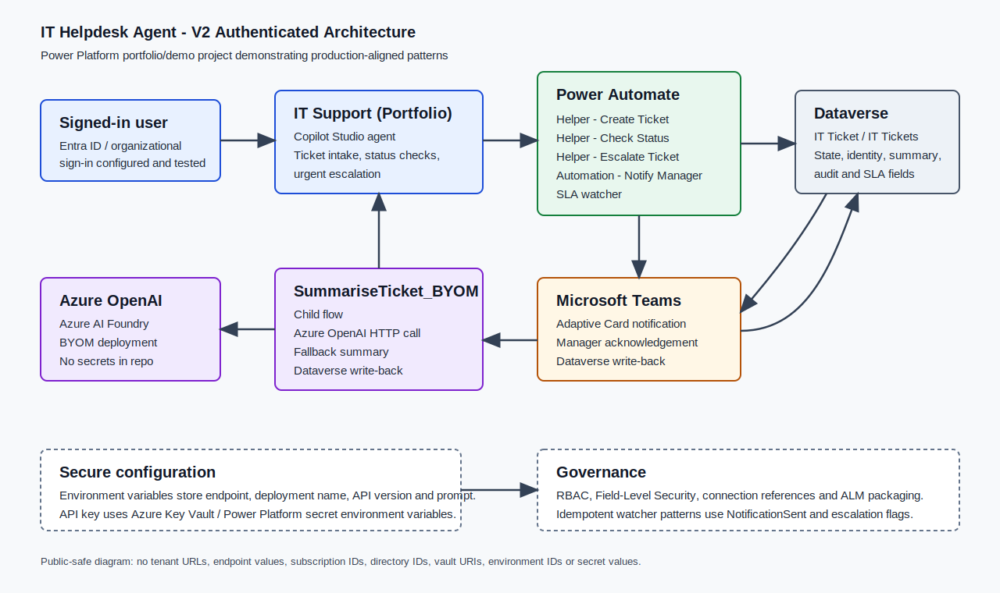

# IT Helpdesk Agent

An authenticated Copilot Studio IT helpdesk agent that uses Dataverse, Power Automate, Teams Adaptive Cards, Azure OpenAI BYOM summarisation, and Entra ID identity context to manage IT support tickets.

This is a portfolio/demo project demonstrating production-aligned Power Platform patterns. It is not presented as a live production ITSM system.

## Links

- [Portfolio case study](https://leilamarchant.co.uk/case-study-it-ticket/)
- [YouTube demo](https://www.youtube.com/watch?v=tYyqenQAeeY)

## Business Problem

Internal helpdesk processes need more than a basic chatbot. A useful support agent should authenticate users, store ticket state reliably, protect ticket visibility, support escalation, notify the right people, and preserve an auditable record of what happened.

This project demonstrates a V2 authenticated helpdesk agent that uses signed-in identity instead of user-typed email for protected actions.

## Solution Overview

The solution is centered on the Copilot Studio agent `IT Support (Portfolio)` inside the Power Platform solution `ITHelpdeskPortfolio` using publisher prefix `lai`.

The user-facing ticket format is `TKT####`, for example `TKT1001`.

Core user journeys:

1. A signed-in user logs a new IT ticket.
2. The user checks ticket status.
3. The user escalates an urgent ticket.
4. Managers receive Teams Adaptive Card notifications.
5. Acknowledgement actions write back to Dataverse.
6. Ticket summaries are generated through a BYOM Azure OpenAI child flow.
7. SLA watcher automation supports reminder and escalation patterns.

## Architecture



Detailed architecture notes are available in [docs/architecture.md](docs/architecture.md).

| Layer | Role |
| --- | --- |
| Copilot Studio | Authenticated V2 agent experience, structured ticket intake, status checks, escalation conversations |
| Power Automate | Helper flows, manager notifications, Teams Adaptive Card write-back, SLA watcher automation, BYOM summarisation |
| Dataverse | System of record for ticket state, identity, escalation, summary, acknowledgement, notification, SLA, and audit fields |
| Microsoft Teams | Adaptive Card notifications and acknowledgement actions |
| Azure OpenAI / Azure AI Foundry | BYOM model deployment for ticket summarisation |
| Azure Key Vault / Power Platform secret environment variables | Secure API key handling for Azure OpenAI |

## What This Demonstrates

- Authenticated Copilot Studio design using Entra ID / organizational sign-in.
- Dataverse as the system of record for helpdesk tickets.
- Power Automate orchestration across create, check status, escalation, notification, SLA, and summary flows.
- Identity-based ticket ownership checks using `RequestorAadObjectId` and `CurrentUserAadObjectId`.
- Teams Adaptive Card notification and acknowledgement write-back.
- BYOM Azure OpenAI summarisation through `SummariseTicket_BYOM`.
- Idempotent notification and escalation design using `NotificationSent` and escalation flags.
- SLA watcher automation and director escalation tracking.
- Field-Level Security for decision, acknowledgement, and escalation fields.
- ALM discipline through solution packaging, environment variables, connection references, and managed deployment planning.

## Built Components

### Copilot Studio

- `IT Support (Portfolio)` authenticated V2 experience.
- Entra ID / organizational sign-in configured and tested.
- Identity-based user context built and tested.
- Structured ticket intake.
- Check ticket status.
- Urgent escalation.
- No typed email used for authorization.

### Power Automate

- `Helper - Create Ticket`
- `Helper - Check Status`
- `Helper - Escalate Ticket`
- `Automation - Notify Manager`
- `SummariseTicket_BYOM`
- SLA watcher / SLA escalation watcher

### Dataverse

`IT Ticket` / `IT Tickets` stores ticket state, requestor identity, escalation, notification, acknowledgement, SLA, AI summary, and audit fields.

### Teams Adaptive Cards

Manager notifications use Teams Adaptive Cards. Acknowledgement actions write back to Dataverse acknowledgement fields.

### BYOM AI Summarisation

`SummariseTicket_BYOM` calls Azure OpenAI / Azure AI Foundry through Power Automate and writes summary output back to Dataverse.

Azure OpenAI configuration is externalised through environment variables, including endpoint, deployment name, API version, and summarisation prompt.

The Azure OpenAI API key is handled through secure secret configuration using Azure Key Vault / Power Platform secret environment variables. The key is retrieved at runtime and is not hardcoded in Power Automate flows, documentation, screenshots, or source files.

## Environment Variables

The repo may document variable names, but it must not contain values.

| Variable | Purpose |
| --- | --- |
| `lai_AOAI_ApiKey` | Secure secret configuration for the Azure OpenAI API key |
| `lai_AOAI_ApiVersion` | Azure OpenAI API version |
| `lai_AOAI_DeploymentName` | Azure OpenAI deployment name |
| `lai_AOAI_Endpoint` | Azure OpenAI endpoint |
| `lai_ITSD_SummarisationPrompt` | Prompt used by the summarisation child flow |

Azure OpenAI configuration is externalised through environment variables. The API key is handled as a secure secret configuration and retrieved at runtime, so it is not hardcoded in the flow or committed to the repository.

## Security And Governance

- Entra ID / organizational sign-in configured and tested.
- `RequestorAadObjectId` compared with `CurrentUserAadObjectId` for ticket ownership checks.
- RBAC / least-privilege security model.
- Field-Level Security on decision, acknowledgement, and escalation fields.
- Dataverse audit-ready state tracking.
- Idempotent watcher patterns using `NotificationSent` and escalation flags.
- Environment variables for deployable configuration.
- Connection references for ALM.
- Unmanaged solution for build, managed solution for deployment.
- No secrets, tenant URLs, endpoint values, subscription IDs, directory IDs, personal account details, or private user data in the repo.

## Current Status

| Area | Status |
| --- | --- |
| V2 authenticated helpdesk design | Built |
| Entra ID / organizational sign-in | Configured and tested |
| Identity-based user context | Built and tested |
| `IT Ticket` / `IT Tickets` Dataverse table | Built |
| Identity-based ownership checks | Built |
| `Helper - Create Ticket` | Built |
| `Helper - Check Status` | Built |
| `Helper - Escalate Ticket` | Built |
| `Automation - Notify Manager` | Built |
| Teams Adaptive Card acknowledgement write-back | Built |
| `SummariseTicket_BYOM` | Built |
| Azure OpenAI secure configuration pattern | Built |
| SLA watcher / escalation watcher | Built |
| `IT Technician Console` | Built |
| Field-Level Security / RBAC design | Built |
| ALM packaging approach | Documented |

## Screenshots And Demo Evidence

Redacted screenshots and demo assets can be added under `screenshots/` when they are public-safe. Do not publish unredacted Azure screenshots. Redact vault URIs, subscription IDs, directory IDs, tenant names, resource group names, endpoint URLs, and account details.

## Documentation

- [Architecture](docs/architecture.md)
- [Project summary](docs/project-summary.md)
- [Implementation notes](docs/implementation-notes.md)
- [Flow documentation](flows/README.md)
- [Dataverse documentation](dataverse/README.md)

## Repository Structure

```text
.
├── agents/          # Sanitized agent notes or exports, when public-ready
├── architecture/    # Public architecture diagram and architecture notes
├── assets/          # Public supporting assets
├── dataverse/       # Public Dataverse schema documentation
├── demo/            # Public demo assets, when prepared
├── docs/            # Public project documentation
├── flows/           # Public Power Automate flow documentation
└── screenshots/     # Redacted public screenshots, when added
```

## Portfolio Disclaimer

This repository documents a portfolio/demo Power Platform project demonstrating production-aligned patterns for authenticated agent design, Dataverse authorization checks, Power Automate orchestration, Teams Adaptive Card write-back, BYOM summarisation, SLA watcher automation, and governance. It should not be treated as a live production ITSM system without a separate production deployment, security review, and operational readiness process.
